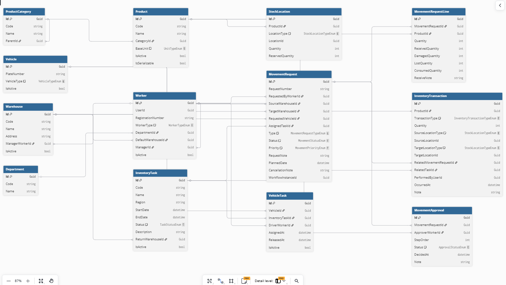
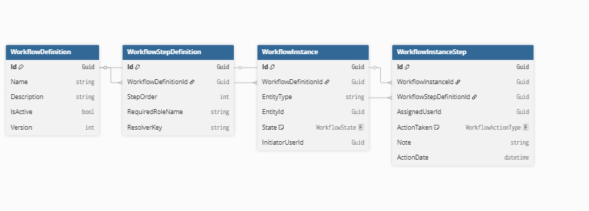

# InventoryTrackingAutomation

Saha ve depo operasyonları için geliştirilmiş kurumsal envanter yönetim sistemi. Stok hareketlerini, çok adımlı onay süreçlerini ve araç/görev bazlı stok takibini tek bir platformda yönetir.

**Stack:** .NET 10 · ABP Framework 10.3.0 · PostgreSQL 17 · Angular 15 · SignalR · OpenIddict

---

## Veri Modeli



### Master / Lookup Tabloları

| Tablo | İşlev |
|-------|-------|
| **Product** | Stok kalemi tanımları. Her ürün bir kategoriye, birim tipine ve seri numaralanabilirlik bilgisine sahiptir. |
| **ProductCategory** | Ürün kategori hiyerarşisi. `ParentId` ile çok seviyeli kategori yapısı desteklenir. |
| **Warehouse** | Depo lokasyonları. Her deponun bir sorumlu yöneticisi (`ManagerWorkerId`) vardır. |
| **Vehicle** | Araç kaydı. Tip bilgisi ve aktiflik durumu tutulur; stok taşıyıcı olarak hareket akışına dahil olur. |
| **Worker** | Personel kaydı. ABP Identity kullanıcısına (`UserId`) bağlıdır; rol, departman, varsayılan depo ve yönetici ilişkilerini taşır. |
| **Department** | Organizasyon birimi. Worker'a atanır. |

### Stok Tabloları

| Tablo | İşlev |
|-------|-------|
| **StockLocation** | Anlık stok bakiyesi. Her kayıt bir ürünün belirli bir lokasyondaki (depo veya araç) mevcut ve rezerve miktarını tutar. Doğrudan güncellenmez; yalnızca `InventoryTransaction` üzerinden değişir. |
| **InventoryTransaction** | Değiştirilemez stok defteri. Her stok hareketi (depodan araca, araçtan depoya, düzeltme) burada bir satır olarak kayıt altına alınır. Kaynak ve hedef lokasyon tipi + ID çifti ile tam izlenebilirlik sağlanır. |

### Hareket Tabloları

| Tablo | İşlev |
|-------|-------|
| **MovementRequest** | Stok transfer talebi. Üç tipi vardır: `WarehouseToWarehouse`, `WarehouseToTask`, `TaskReturnToWarehouse`. Kendi yaşam döngüsü (`Pending → Approved → Shipped → Completed`) ve bağlı bir workflow instance'ı vardır. |
| **MovementRequestLine** | Talep kalemleri. Her ürün için istenilen miktar, teslim alınan/hasarlı/kayıp/tüketilen miktarlar ayrı ayrı tutulur. İade akışında kalem bazlı kalite doğrulaması buradan yapılır. |
| **MovementApproval** | Onay adımı kayıtları. Hangi onaylayıcının hangi adımda ne zaman ne kararı verdiğini saklar. |

### Operasyon Tabloları

| Tablo | İşlev |
|-------|-------|
| **InventoryTask** | Saha görevi. Başlangıç/bitiş tarihi, bölge ve iade deposu bilgisini taşır. Tamamlandığında veya iptal edildiğinde otomatik olarak `TaskReturnToWarehouse` talebi oluşturulur. |
| **VehicleTask** | Göreve araç ve sürücü ataması. Bir göreve birden fazla araç atanabilir. |

---

## Dinamik Workflow Motoru



Sistemin en kritik bileşeni: **kod değişikliği gerektirmeden yeni onay akışı tanımlanabilen** dinamik bir workflow motorudur.

### Nasıl Çalışır?

```
WorkflowDefinition          →  "Bu tip talep için N adımlı onay gerekir"
  └── WorkflowStepDefinition  →  "Adım 2'yi kim onaylayacak?" (ResolverKey)
        ↓  tetiklenince
WorkflowInstance            →  Belirli bir talebin aktif onay süreci
  └── WorkflowInstanceStep    →  Adım bazında kimin, ne zaman, ne kararı verdiği
```

### WorkflowDefinition & WorkflowStepDefinition

Onay akışının şablonu. Veritabanında saklandığı için **deploy olmadan** değiştirilebilir.

- `Version` ile birden fazla aktif versiyon yan yana çalışabilir.
- Her adım (`WorkflowStepDefinition`) bir `ResolverKey` taşır. Bu key, o adımı kimin onaylayacağını belirleyen **Strategy**'yi işaret eder.

### Strategy Pattern ile Onaylayıcı Çözümleme

`ResolverKey` değerine göre runtime'da doğru onaylayıcı bulunur:

| ResolverKey | Kim onaylar |
|-------------|-------------|
| `InitiatorManager` | Talebi açan kişinin yöneticisi |
| `SourceWarehouseManager` | Kaynak depo sorumlusu |
| `TargetWarehouseManager` | Hedef depo sorumlusu |
| `LogisticsManager` | Lojistik yöneticisi |

Yeni bir onaylayıcı tipi eklemek için **sadece yeni bir `IApproverStrategy` implementasyonu** yazmak yeterlidir. Mevcut koda dokunulmaz.

### WorkflowInstance & WorkflowInstanceStep

Bir talep onaya girdiğinde şablon'dan türetilen runtime kaydı oluşur:

- `EntityType` + `EntityId` ile workflow hangi talebe bağlı olduğunu bilir — aynı motor farklı entity tipleri için kullanılabilir.
- `State`: `Pending`, `InProgress`, `Approved`, `Rejected`
- Her adım tamamlandığında `WorkflowActionType` (Approve/Reject) ve karar tarihi kayıt altına alınır.
- Tüm adımlar onaylandığında `WorkflowInstance.State = Approved` olur ve talep `MovementRequest.Status = Approved`'a geçer. **Stok bu noktada hareket etmez.**

### Stok Ne Zaman Hareket Eder?

```
Approved → [Dispatch endpoint] → Shipped    : Stok kaynaktan araca geçer
Shipped  → [Receive endpoint]  → Completed  : Stok araçtan hedefe geçer
```

Onay ve stok transferi birbirinden tam anlamıyla ayrılmıştır. Onay iş akışını yönetir; fiziksel teslimat ayrı bir adımdır.

---

## Hareket Tipleri ve Yaşam Döngüsü

```
WarehouseToWarehouse   : Depo → Araç → Depo
WarehouseToTask        : Depo → Araç → Saha görevi
TaskReturnToWarehouse  : Saha görevi (tamamlanınca otomatik) → Araç → Depo
```

```
Pending → InReview → Approved → Shipped → Completed
                ↘ Rejected      ↘ Cancelled
```

**TaskReturnToWarehouse** otomatik olarak açılır — saha görevini kapatan kişi `ReturnWarehouseId`'yi belirtmiş olmalıdır. Her kalem için dört miktar ayrı girilir: `ReceivedQuantity`, `DamagedQuantity`, `LostQuantity`, `ConsumedQuantity`.

---

## Mimari

```
Domain.Shared       Enum, hata kodları, ETO event'leri
Domain              Entity'ler, Manager'lar, repository interface'leri, event handler'lar
Application.Contracts  DTO'lar, IAppService interface'leri, FluentValidation kuralları
Application         AppService implementasyonları, AutoMapper profilleri
EntityFrameworkCore DbContext, Fluent API konfigürasyonları, migration'lar
HttpApi             REST controller'lar
HttpApi.Host        Startup, middleware pipeline, SignalR hub, Swagger
```

**Temel kurallar:**
- İş mantığı `Manager` sınıflarındadır. `AppService` sadece orkestrasyon yapar.
- Entity'ler arasında navigation property yoktur; yalnızca `XxxId` FK referansı kullanılır.
- Tüm stok hareketleri `InventoryTransaction` üzerinden geçer — `StockLocation` doğrudan güncellenmez.
- Controller'lar `Result<T>` döner, ham DTO dönmez.

---

## Kurulum

```bash
# PostgreSQL başlat
docker-compose up -d

# Uygulama ayağa kaldır
dotnet run --project host/InventoryTrackingAutomation.HttpApi.Host

# Auth server (ayrı terminal)
dotnet run --project host/InventoryTrackingAutomation.AuthServer

# Testler
dotnet test
```

Bağlantı bilgileri `appsettings.secrets.json` dosyasına yazılır (git'e dahil değildir).

**Seed kullanıcılar:** 11 test kullanıcısı, şifre `123456aA@`

---

## CI/CD

| Workflow | Tetikleyici | Görev |
|----------|-------------|-------|
| .NET CI | push / PR | Build + test |
| CodeQL | push / PR / haftalık | C# güvenlik analizi |
| Docker Build | push | GHCR'a image push |
