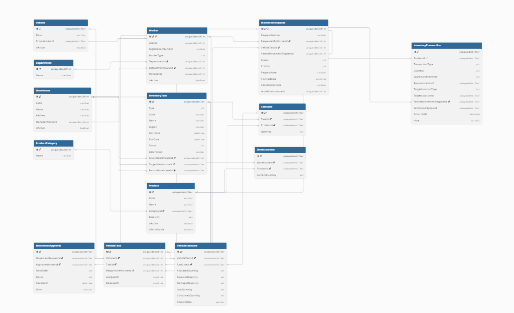
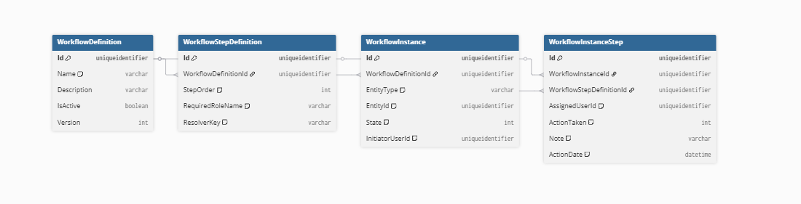

# InventoryTrackingAutomation

InventoryTrackingAutomation, depo, arac ve gorev bazli envanter takibi icin gelistirilmis backend odakli bir .NET 10 / ABP Framework projesidir. Sistem; urunlerin depodaki stok durumunu, araca yuklenmesini, aracin aktif gorevini, gorev kapsamindaki envanteri, stok hareketlerini ve onay sureclerini birlikte takip eder.

Bu teslim backend kapsamindadir. Frontend kurulumu zorunlu akisa dahil degildir; API, Swagger ve PostgreSQL veritabani uzerinden dogrulanir.

## Icindekiler

- [Mimari](#mimari)
- [Setup](#setup)
- [Usage](#usage)
- [Teknik Tercihler](#teknik-tercihler)

## Mimari

### Teknoloji Ozeti

| Alan | Teknoloji |
| --- | --- |
| Runtime | .NET 10 |
| Framework | ABP Framework 10.3 |
| Database | PostgreSQL |
| ORM | Entity Framework Core |
| Authentication | OpenIddict + JWT Bearer |
| Authorization | ABP Permission Management + role based access control |
| Cache | Redis |
| Real-time | SignalR |
| Logging | Serilog file/console + ABP Audit Logging |
| API Docs | Swagger / OpenAPI |
| Response/Error Standards | SystemStandards middleware ve result modeli |

### Backend Mimarisi

Proje katmanli ABP mimarisiyle ayrilmistir. Business logic controller icinde tutulmaz; domain manager siniflarinda toplanir.

```text
Domain.Shared
  Enums, constants, error codes, permissions, localization, events

Domain
  Entities, managers, repository interfaces, domain models, event handlers, seed data

Application.Contracts
  DTOs, app service interfaces, FluentValidation validators, permission definitions

Application
  AppServices, AutoMapper profiles, application orchestration

EntityFrameworkCore
  DbContext, entity configurations, repositories, migrations

HttpApi
  REST controllers

HttpApi.Host
  Startup, middleware pipeline, Swagger, OpenIddict, SignalR, Redis, seed trigger
```

### Domain Model



Sistemin merkezindeki operasyon zinciri sudur:

```text
InventoryTask
  -> TaskLine
  -> VehicleTask
      -> VehicleTaskLine
      -> MovementRequest
          -> InventoryTransaction
```

| Entity | Gorevi |
| --- | --- |
| `Product` | Envanter urun bilgisi: telsiz, jenerator, ekipman vb. |
| `Warehouse` | Urunlerin tutuldugu depo/lokasyon. |
| `Vehicle` | Envanter tasiyabilen arac. |
| `InventoryTask` | Operasyonel gorev. Surec tipini, kaynak/hedef/iade deposunu ve gorev durumunu tutar. |
| `TaskLine` | Gorevde istenen urun ve toplam miktar. |
| `VehicleTask` | Aracin goreve atanmasi. Bir arac farkli zamanlarda farkli gorevlerde yer alabilir. |
| `VehicleTaskLine` | Gorev kaleminin araca tahsis edilen miktari ve iade uzlasmasi. |
| `MovementRequest` | Onay, sevk ve teslim alma bileti. Urun/rota tekrar etmez; `VehicleTaskId` uzerinden cozulur. |
| `MovementApproval` | Hareket talebinin workflow onay gecmisi. |
| `InventoryTransaction` | Stok hareketlerinin degistirilemez kronolojik defteri. |
| `StockLocation` | Urunlerin depo/arac bazli guncel miktari. |

### Temel Mimari Kararlar

- `MovementRequest` urun, gorev ve depo rotasini tekrar saklamaz.
- Gorev tipi `InventoryTask.Type` alanindan gelir.
- Rota `InventoryTask.SourceWarehouseId`, `TargetWarehouseId`, `ReturnWarehouseId` alanlarindan gelir.
- Urun bilgisi `TaskLine.ProductId` alanindan gelir.
- Arac bilgisi `VehicleTask.VehicleId` alanindan gelir.
- Araca yuklenecek miktar `VehicleTaskLine.AllocatedQuantity` alanindan gelir.
- Stok hareketi sadece `InventoryTransaction.RelatedMovementRequestId` ile hareket talebine baglanir.
- Soft delete kullanilan tablolarda aktif kayitlar `IsDeleted = false` filtresiyle calisir.

### Veritabani Tasarimi

Veritabani PostgreSQL uzerinde normalize edilmis semalarla calisir. Tablo isimleri snake_case olacak sekilde EF Core naming convention ve explicit table mapping kullanilir.

| Schema | Icerik |
| --- | --- |
| `abp` | Identity, permissions, settings, audit logs, feature/tenant tablolari |
| `openiddict` | OAuth2 / OpenIddict client, token ve authorization tablolari |
| `lookup` | `departments`, `product_categories` |
| `master` | `products`, `warehouses`, `vehicles`, `workers` |
| `inventory` | `stock_locations`, `inventory_transactions` |
| `operation` | `tasks`, `task_lines`, `vehicle_tasks`, `vehicle_task_lines` |
| `movement` | `movement_requests`, `movement_approvals` |
| `workflow` | `workflow_definitions`, `workflow_step_definitions`, `workflow_instances`, `workflow_instance_steps` |

### Audit ve Log Tablolari

ABP Audit Logging aktiftir. `InventoryTrackingAutomationDbContext` icinde `ConfigureAuditLogging()` cagrilir ve audit tablolari `abp` semasina yazilir.

| Tablo | Gorevi |
| --- | --- |
| `abp.AbpAuditLogs` | Request, user, execution time ve genel audit kaydi |
| `abp.AbpAuditLogActions` | Service/action seviyesinde calisma detaylari |
| `abp.AbpEntityChanges` | Entity degisiklikleri |
| `abp.AbpEntityPropertyChanges` | Property bazli degisiklikler |
| `abp.AbpAuditLogExcelFiles` | ABP audit export kayitlari |

Serilog ayrica `host/InventoryTrackingAutomation.HttpApi.Host/Logs/logs.txt` dosyasina ve console'a log yazar.

### Workflow Mimarisi



Workflow katmani hareket talebinin onay surecini tablo uzerinden yonetir.

| Entity | Gorevi |
| --- | --- |
| `WorkflowDefinition` | Is akisinin ana tanimi. Dinamik yapidadir; hangi entity icin calisacagi `EntityType` ve `EntityId` ile instance baslatilirken belirlenir. |
| `WorkflowStepDefinition` | Tanimin adimlari. Her adim hangi resolver ile onayci bulacagini bilir. |
| `WorkflowInstance` | Belirli bir entity kaydi icin baslatilan calisan is akisi. Ornek olarak hareket taleplerinde `EntityType = MovementRequest` kullanilir. |
| `WorkflowInstanceStep` | Instance icindeki tekil onay adimi; atanan kullanici, karar ve notu tutar. |

### Seedlenen Workflow Tanimlari

| Workflow | Ne zaman kullanilir | Adimlar |
| --- | --- | --- |
| `MovementRequest` | Standart malzeme hareketi onay akisi | 1. Talebi acan kullanicinin yoneticisi, 2. Hedef depo yoneticisi, 3. Kaynak depo yoneticisi |
| `TaskMovementRequest` | Saha/gorev malzeme cikislarinda daha kisa onay akisi. Bu bir domain entity degil, seedlenen workflow definition adidir. | 1. Talebi acan kullanicinin yoneticisi, 2. Lojistik yoneticisi |

### Resolver Mantigi

| Resolver Key | Ne yapar |
| --- | --- |
| `InitiatorManager` | Talebi baslatan kullanicinin worker kaydindan `ManagerId` cozer. |
| `SourceWarehouseManager` | Hareketin kaynak deposunun `ManagerWorkerId` alanindan onayci cozer. |
| `TargetWarehouseManager` | Hareketin hedef deposunun `ManagerWorkerId` alanindan onayci cozer. |
| `LogisticsManager` | Lojistik yonetici rol/hiyerarsisi uzerinden onayci cozer. |

Workflow tamamlandiginda hareket talebi `Approved` durumuna gelir. Ardindan `dispatch` endpointi stok hareketini baslatabilir.

### Workflow Katmaninin Calisma Sekli

Workflow yapisi entity'den bagimsiz tasarlanmistir. `WorkflowDefinition` sadece onay adimlarini tarif eder; hangi kayda uygulanacagi `WorkflowInstance.EntityType` ve `WorkflowInstance.EntityId` ile calisma aninda belirlenir.

```text
WorkflowAppService
  -> WorkflowManager
      -> IWorkflowDefinitionRepository
      -> IWorkflowInstanceRepository
      -> IWorkflowInstanceStepRepository
      -> IWorkflowApproverResolver
          -> IApproverStrategy implementasyonlari
```

| Parca | Sorumluluk |
| --- | --- |
| `WorkflowAppService` | DTO alir, current user bilgisini ekler, unit of work icinde manager'i cagirir. |
| `WorkflowManager` | State machine'i yonetir: workflow baslatir, pending step'i dogrular, onay/red kararini isler, sonraki adima gecer veya sureci bitirir. |
| `DefaultWorkflowApproverResolver` | Step definition icindeki `ResolverKey` degerine gore dogru strategy'yi bulur. |
| `IApproverStrategy` | Onayciyi cozen kucuk strateji siniflaridir. Yeni resolver eklemek icin yeni strategy eklemek yeterlidir. |
| `WorkflowCompletedEto` | Workflow tamamlaninca local event olarak yayinlanir; hareket talebi bu event ile onay/red sonucuna baglanir. |
| `WorkflowStepAssignedEto` | Yeni step atandiginda yayinlanir; bildirim/SignalR tarafina genisletilebilir. |

Onay akisi sirasi:

1. Ilgili workflow definition bulunur.
2. `WorkflowInstance` olusur ve islem yapilacak kayda `EntityType` / `EntityId` ile baglanir.
3. Ilk `WorkflowStepDefinition` sirasina gore secilir.
4. Resolver key uzerinden onayci user cozulur.
5. `WorkflowInstanceStep` pending olarak kaydedilir.
6. Onayci `process-approval` endpointinden karar verir.
7. Karar `Rejected` ise instance kapanir ve hareket talebi reddedilir.
8. Karar `Approved` ise siradaki step acilir.
9. Son step de onaylaninca instance `Completed` olur ve hareket talebi `Approved` durumuna gecer.

Movement akisi icin pratik endpointler genellikle `MovementApprovalController` uzerinden kullanilir:

| Islem | Endpoint |
| --- | --- |
| Hareket talebinin onay gecmisi | `GET /api/movement-requests/{id}/approvals` |
| Hareket talebini onayla/reddet | `POST /api/movement-requests/{id}/process-approval` |
| Bekleyen hareket onaylari | `GET /api/movement-requests/pending-approvals` |

## Setup

Bu bolum projeyi sifir bilgisayarda terminal veya herhangi bir .NET destekli IDE ile ayaga kaldirmak icin yazilmistir. Zorunlu olan IDE degil; .NET 10 SDK, PostgreSQL, Redis ve dogru startup projesidir.

### 1. Gerekli Kurulumlar

Bilgisayarda sunlar kurulu olmalidir:

| Gereksinim | Neden gerekli |
| --- | --- |
| .NET destekleyen IDE veya terminal | Solution'i acmak veya `dotnet` komutlarini calistirmak icin |
| .NET 10 SDK | `dotnet restore`, `dotnet build`, `dotnet run`, EF migration komutlari icin |
| Docker Desktop | PostgreSQL ve Redis'i tek komutla baslatmak icin |
| Git | Repo klonlamak icin |

Kurulum kontrol komutlari:

```powershell
dotnet --version
docker --version
docker compose version
git --version
```

`dotnet ef` yuklu degilse:

```powershell
dotnet tool install --global dotnet-ef
```

Daha once yuklu ama eskiyse:

```powershell
dotnet tool update --global dotnet-ef
```

### 2. Repo'yu Ac

```powershell
git clone <repo-url>
cd InventoryTrackingAutomation
```

Istersen `InventoryTrackingAutomation.sln` dosyasini kullandigin IDE ile ac. IDE kullanmadan terminalden devam etmek de yeterlidir.

### 3. PostgreSQL ve Redis'i Baslat

Proje localde PostgreSQL ve Redis ister. En kolay yol Docker Compose kullanmaktir:

```powershell
docker compose up -d
```

Bu komut sunlari baslatir:

| Servis | Port | Kullanici | Sifre | Veritabani |
| --- | --- | --- | --- | --- |
| PostgreSQL | `5432` | `postgres` | `postgres` | `InventoryTrackingAutomationdb` |
| Redis | `6379` | - | - | - |

Servisleri kontrol etmek icin:

```powershell
docker ps
```

Veritabanini tamamen sifirlamak gerekirse:

```powershell
docker compose down -v
docker compose up -d
```

### 4. Connection String ve Environment

Ana API host ayari:

```json
"ConnectionStrings": {
  "Default": "Host=localhost;Port=5432;Database=InventoryTrackingAutomationdb;Username=postgres;Password=postgres;"
},
"Redis": {
  "Configuration": "127.0.0.1"
}
```

Bu ayarlar su dosyada bulunur:

```text
host/InventoryTrackingAutomation.HttpApi.Host/appsettings.json
```

Development ortaminda calistirma:

```powershell
$env:ASPNETCORE_ENVIRONMENT = "Development"
```

Farkli bir PostgreSQL kullanilacaksa connection string bu dosyada degistirilir veya environment variable ile override edilir:

```powershell
$env:ConnectionStrings__Default = "Host=localhost;Port=5432;Database=InventoryTrackingAutomationdb;Username=postgres;Password=postgres;"
$env:Redis__Configuration = "127.0.0.1"
```

### 5. NuGet Paketlerini Yukle

```powershell
dotnet restore InventoryTrackingAutomation.sln
```

### 6. Veritabani Migrationlarini Uygula

Ilk calistirmadan once PostgreSQL sema ve tablolarinin olusmasi gerekir.

```powershell
dotnet ef database update `
  --project src/InventoryTrackingAutomation.EntityFrameworkCore `
  --startup-project host/InventoryTrackingAutomation.HttpApi.Host `
  --context InventoryTrackingAutomationDbContext
```

Bu komut su semalari ve tablolari olusturur:

- `abp`
- `openiddict`
- `lookup`
- `master`
- `inventory`
- `operation`
- `movement`
- `workflow`

### 7. Sadece HttpApi.Host'u Calistir

Bu projede demo/backend teslimi icin uygulama `HttpApi.Host` uzerinden ayaga kaldirilir. Ayrica AuthServer baslatma adimi yoktur.

Komut satirindan:

```powershell
dotnet run --project host/InventoryTrackingAutomation.HttpApi.Host --urls http://localhost:5000
```

IDE uzerinden calistirmak istersen:

1. Solution'i ac.
2. Startup project olarak `host/InventoryTrackingAutomation.HttpApi.Host` sec.
3. Run configuration olarak `HttpApi.Host` sec.
4. Yesil Run butonuna bas.

### 8. Swagger'a Gir

API ayaga kalkinca:

```text
http://localhost:5000/swagger
```

Host ilk acilista seed data calistirir. Bu nedenle ilk calistirma sonrasi veritabaninda roller, kullanicilar, master data, stok, task ve workflow verileri hazir olur.

### 9. Build ve Test

Build:

```powershell
dotnet build InventoryTrackingAutomation.sln --no-restore
```

Kritik hareket akisi testleri:

```powershell
dotnet test test/InventoryTrackingAutomation.EntityFrameworkCore.Tests/InventoryTrackingAutomation.EntityFrameworkCore.Tests.csproj --no-restore --filter MovementFlow_Integration_Tests
```

### Seed Data

Seed data `HttpApi.Host` initialize olurken calisir. Amac, projeyi sifirdan kuran kisinin hemen login olup rol/yetki, stok, arac, gorev ve workflow akisini test edebilmesidir.

### Seed Kullanici Bilgileri

Tum demo kullanicilarin sifresi:

```text
123456aA@
```

Hizli login icin en pratik kullanici:

```http
POST /api/auth/login
Content-Type: application/json

{
  "userName": "admin",
  "password": "123456aA@"
}
```

| Username | Email | Rol | Worker Reg No | Hiyerarsi |
| --- | --- | --- | --- | --- |
| `admin` | `admin@inventorysystem.local` | `Admin` | `ADM-001` | Ust kullanici |
| `manager.istanbul` | `manager.istanbul@inventorysystem.local` | `Manager` | `MGR-001` | `admin` altinda |
| `supervisor.logistics` | `supervisor.logistics@inventorysystem.local` | `LogisticsSupervisor` | `SUP-LOG-001` | `manager.istanbul` altinda |
| `approver.warehouse` | `approver.warehouse@inventorysystem.local` | `WorkflowApprover` | `APP-001` | `supervisor.logistics` altinda |
| `worker.warehouse01` | `worker.warehouse01@inventorysystem.local` | `WarehouseWorker` | `WRK-WH-001` | `approver.warehouse` altinda |
| `worker.warehouse02` | `worker.warehouse02@inventorysystem.local` | `WarehouseWorker` | `WRK-WH-002` | `approver.warehouse` altinda |
| `worker.field01` | `worker.field01@inventorysystem.local` | `FieldWorker` | `WRK-FLD-001` | `supervisor.logistics` altinda |
| `worker.field02` | `worker.field02@inventorysystem.local` | `FieldWorker` | `WRK-FLD-002` | `supervisor.logistics` altinda |
| `manager.vehicle` | `manager.vehicle@inventorysystem.local` | `VehicleManager` | `MGR-VHC-001` | `manager.istanbul` altinda |
| `driver.ali` | `driver.ali@inventorysystem.local` | `Driver` | `DRV-001` | `manager.vehicle` altinda |
| `driver.veli` | `driver.veli@inventorysystem.local` | `Driver` | `DRV-002` | `manager.vehicle` altinda |

### Rol ve Yetki Ozeti

| Rol | Temel Yetkiler |
| --- | --- |
| `Admin` | Tum permission'lar |
| `Manager` | Movement view/dispatch/receive, workflow approve/reject, inventory manage, task manage/complete, vehicle task manage, task line ve vehicle task line manage |
| `WorkflowApprover` | Movement view, workflow approve/reject, inventory/master view, task ve line view |
| `WarehouseWorker` | Movement view, workflow approve, movement dispatch/receive, task/vehicle/line view |
| `FieldWorker` | Movement view/create/receive, workflow view, inventory/master/task/vehicle/line view |
| `LogisticsSupervisor` | Workflow approve/reject, movement dispatch/receive, inventory manage, task manage/complete, line manage |
| `VehicleManager` | Master manage, vehicle task manage, vehicle task line create/edit/delete |
| `Driver` | Inventory view, movement receive, task/vehicle/line view |

### Seed Master Data

| Tip | Seed Ornekleri |
| --- | --- |
| Departments | `DEP-LOJ` Lojistik Departmani, `DEP-SAH` Saha Operasyonlari |
| Product Categories | `CAT-01` Hammadde ve Yapi Malzemeleri, `CAT-02` Demirbas ve Ekipmanlar |
| Warehouses | `WH-01` Merkez Lojistik Deposu, `WH-02` Anadolu Yakasi Depo |
| Vehicles | `34 ABC 123`, `34 ABC 456`, `34 DEF 789`, `34 GHI 101`, `34 JKL 202` |
| Products | `PRD-01` C30 Hazir Beton, `PRD-02` Nervurlu Insaat Demiri, `PRD-03` Saf Kum, `PRD-04` Cakil, `EQP-01` Hilti, `EQP-02` Matkap, `EQP-03` Iskele, `EQP-04` Guvenlik Kemeri |

### Seed Stok Ornekleri

Baslangicta stoklar agirlikli olarak `WH-01` ve `WH-02` depolarinda olusur. Ornek:

| Urun | Lokasyon | Miktar | Rezerve |
| --- | --- | ---: | ---: |
| `PRD-01` C30 Hazir Beton | `WH-01` | 1000 | 150 |
| `PRD-02` Nervurlu Demir | `WH-01` | 50 | 10 |
| `PRD-03` Saf Kum | `WH-01` | 500 | 100 |
| `PRD-04` Cakil | `WH-01` | 800 | 200 |
| `EQP-01` Hilti | `WH-01` | 10 | 2 |
| `EQP-02` Matkap | `WH-01` | 8 | 1 |
| `EQP-03` Iskele | `WH-01` | 50 | 15 |
| `EQP-04` Guvenlik Kemeri | `WH-01` | 100 | 20 |
| `PRD-01` C30 Hazir Beton | `WH-02` | 600 | 50 |

### Seed Surec Verileri

Seed sadece master data eklemez; demo sureci anlatmak icin gorev, arac gorevi, hareket talebi ve stok hareketi de ekler.

| Kod | Gorev | Tip | Amac |
| --- | --- | --- | --- |
| `TSK-001` | Izmir Saha Destek Gorevi | `FieldOperation` | Saha gorevine arac ve ekipman tahsisi |
| `TSK-002` | Ankara Bakim Gorevi | `FieldOperation` | Ikinci saha gorevi |
| `TSK-003` | Bursa Acil Mudahale | `FieldOperation` | Acil operasyon ornegi |

Task line ve vehicle task line seedleri su mantigi gosterir:

- `TaskLine`: Gorevde toplam kac adet urun istendigini tutar.
- `VehicleTaskLine`: Bu talebin hangi araca kac adet tahsis edildigini tutar.
- `StockLocation`: Depoda veya aracta kalan guncel fiziksel miktari tutar.
- `InventoryTransaction`: Depodan araca yapilan hareketin kronolojik kaydini tutar.

## Usage

### Login

```http
POST /api/auth/login
Content-Type: application/json

{
  "userName": "admin",
  "password": "123456aA@"
}
```

Donen access token Swagger'da Authorize alanina girilir.

### Piton Task'ta Istenen Ana Endpointler

| Soru | Endpoint |
| --- | --- |
| Urunleri listele | `GET /api/products` |
| Bir urunun toplam stogu, depo/arac/gorev dagilimi | `GET /api/products/{id}/stock-summary` |
| Araclari listele | `GET /api/vehicles` |
| Aracin uzerindeki envanterler | `GET /api/vehicles/{id}/inventories` |
| Gorevleri listele | `GET /api/tasks` |
| Gorevdeki araclar | `GET /api/tasks/{id}/vehicles` |
| Gorevdeki envanterler | `GET /api/tasks/{id}/inventory` |
| Stok hareketleri | `GET /api/inventory-transactions` |

### Operasyon Endpointleri

| Islem | Endpoint |
| --- | --- |
| Gorev olustur | `POST /api/tasks` |
| Gorev kalemlerini listele | `GET /api/tasks/{id}/lines` |
| Goreve urun kalemi ekle | `POST /api/tasks/{id}/lines` |
| Araci goreve ata | `POST /api/vehicle-tasks` |
| Arac-gorev kalemlerini listele | `GET /api/vehicle-tasks/{id}/lines` |
| Araca gorev kalemi tahsis et | `POST /api/vehicle-tasks/{id}/lines` |
| Hareket talebi olustur | `POST /api/movement-requests` |
| Bekleyen onaylari gor | `GET /api/movement-requests/pending-approvals` |
| Hareket talebini onayla/reddet | `POST /api/movement-requests/{id}/process-approval` |
| Depodan araca sevk et | `POST /api/movement-requests/{id}/dispatch` |
| Aractan depoya veya gorev kabulune teslim al | `POST /api/movement-requests/{id}/receive` |
| Gorevi tamamla | `POST /api/tasks/{id}/complete` |

### Temel Is Akislari

### 1. Urun Stok Sorgusu

Piton task'taki soru:

> "Telsiz urununden toplam kac adet var, kaci depoda, hangi gorevde, kaci aracta?"

Bu projede karsiligi:

```http
GET /api/products/{productId}/stock-summary
```

Sistem `StockLocation`, aktif `VehicleTask`, `TaskLine` ve `VehicleTaskLine` iliskilerini kullanarak stok dagilimini lokasyon bazli verir.

### 2. Arac Envanter Sorgusu

Piton task'taki soru:

> "34 ABC 123 plakali arac hangi gorevde ve hangi envanterleri tasiyor?"

Bu projede once arac bulunur:

```http
GET /api/vehicles
```

Ardindan envanterleri istenir:

```http
GET /api/vehicles/{vehicleId}/inventories
```

Aktif gorev, `VehicleTask.ReleasedAt == null` olan kayittan cozulur.

### 3. Gorev Envanter Sorgusu

Piton task'taki soru:

> "Izmir Saha Destek Gorevi kapsaminda hangi arac var, uzerinde hangi envanterler bulunuyor?"

Bu projede:

```http
GET /api/tasks/{taskId}/vehicles
GET /api/tasks/{taskId}/inventory
```

### 4. Depodan Araca Sevk Akisi

1. `POST /api/tasks` ile gorev acilir.
2. `POST /api/tasks/{id}/lines` ile gorevde istenen urunler eklenir.
3. `POST /api/vehicle-tasks` ile arac goreve atanir.
4. `POST /api/vehicle-tasks/{id}/lines` ile gorev kalemi araca tahsis edilir.
5. `POST /api/movement-requests` ile hareket talebi olusturulur.
6. Workflow onaylari `POST /api/movement-requests/{id}/process-approval` ile tamamlanir.
7. `POST /api/movement-requests/{id}/dispatch` ile stok `Warehouse -> Vehicle` hareket eder.

### 5. Warehouse Transfer Receive Akisi

Warehouse transfer gorevinde receive:

```text
Vehicle -> TargetWarehouse
```

Sonuc:

- Movement `Completed` olur.
- Task `Completed` olur.
- Vehicle assignment release edilir.
- `InventoryTransaction` kaydi olusur.
- `StockLocation` depo/arac miktarlari guncellenir.

### 6. Field Operation ve Iade Akisi

Field operation gorevinde ana receive stoklari aracta birakir; cunku ekipman sahada kullanilmaya devam eder.

Gorev tamamlandiginda sistem return movement olusturur. Return receive sirasinda her `VehicleTaskLine` icin su toplam kontrol edilir:

```text
ReceivedQuantity + DamagedQuantity + LostQuantity + ConsumedQuantity == AllocatedQuantity
```

Sonuc:

- Saglam miktar depoya geri girer.
- Hasarli/kayip/tuketilen miktar adjustment olarak kayitlanir.
- Arac gorev kalemi uzerindeki reconciliation alanlari dolar.
- Vehicle assignment release edilir.

## Teknik Tercihler

| Tercih | Gerekce |
| --- | --- |
| ABP Framework | Moduler yapi, identity, permission, audit, unit of work ve repository altyapisi hazir gelir. |
| PostgreSQL | Iliskisel veri modeli, FK, transaction ve migration destegi guclu. |
| Entity-first movement modeli | `MovementRequest` icine urun/rota/task duplicate etmeyerek veri tekrarini azaltir. |
| `TaskLine` + `VehicleTaskLine` ayrimi | Gorevde istenen toplam miktar ile araca tahsis edilen miktari ayirir. |
| `InventoryTransaction` ledger | Stok hareketleri geriye donuk izlenebilir ve denetlenebilir kalir. |
| `StockLocation` read model | Urunlerin anlik depo/arac dagilimini hizli okumayi saglar. |
| Workflow tablolari | Onay adimlari kod icine gomulmez; tanim ve instance olarak izlenir. |
| Redis cache | Sik okunan stok ozetleri ve arac envanteri icin performans avantaji saglar. |
| SignalR | Workflow onayi gibi kritik aksiyonlarda canli bildirim altyapisi saglar. |
| SystemStandards | Hata, validation, operation context ve response standardizasyonu icin kullanilir. |
| Serilog + ABP Audit Logging | Hem uygulama logu hem de audit trail ihtiyacini karsilar. |
